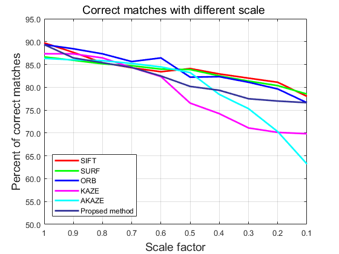
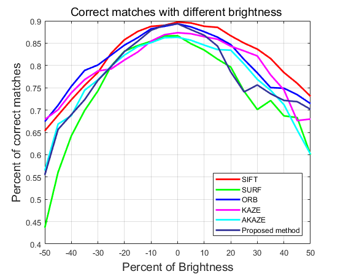
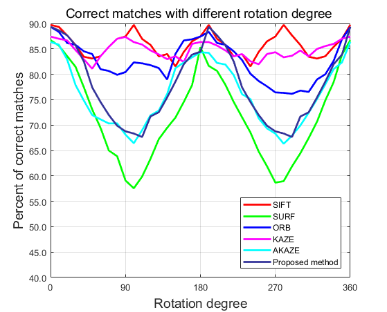
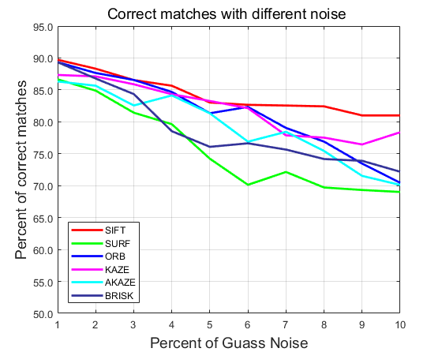
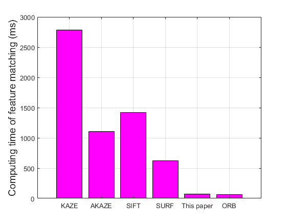

# Detialed contrast of feature point with multi-scale ORB and others

> Experimental data is a single-channel **grayscale image** sequence which collected from the camera installed driverless vehicle platform with resolution of **1234 * 1624**. Furthermore, for this project, a computer with an Intel Core i5-5246m running at **2.20 GHz** and **8 GB RAM** using Windows 10 which program environment is **C++** was used.Test

1. Scale factor

2. Brightness

3. Rotation

4. Noise

5. Computing time

   
